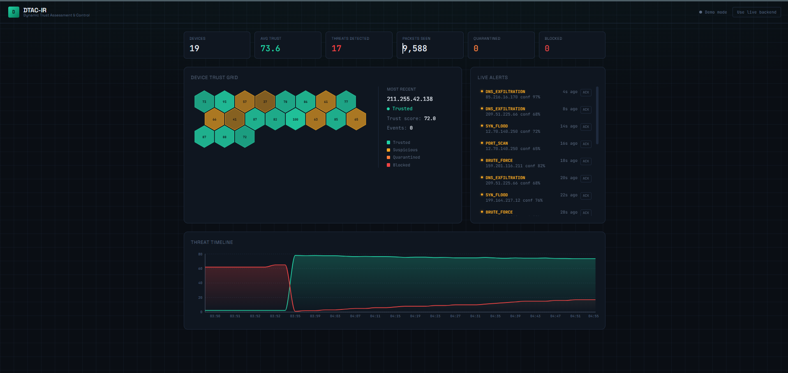
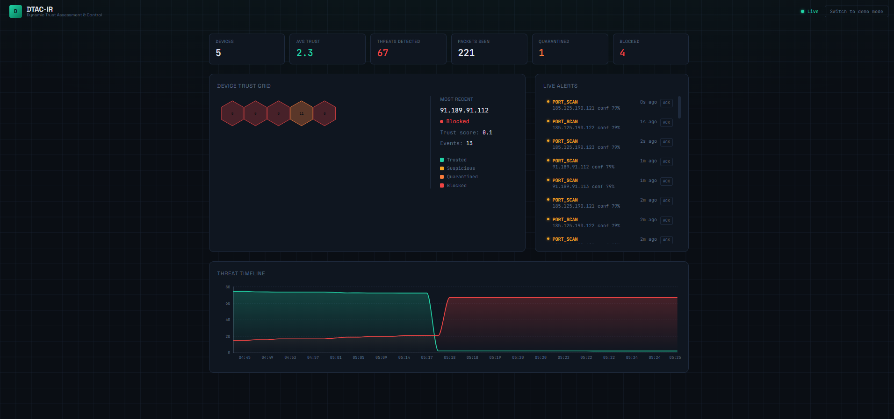

# DTAC-IR


> AI-Powered Intrusion Detection & Incident Response Platform

Monitor live network traffic, identify suspicious behavior using machine learning and rule-based analysis, calculate trust scores, and visualize incidents through a modern security dashboard.


---
## 📑 Table of Contents

- [Overview](#dtac-ir)
- [Demo Video](#demo-video)
- [Screenshots](#screenshots)
- [Why This Project Exists](#why-this-project-exists)
- [Architecture](#architecture)
- [Technology Stack](#technology-stack)
- [Installation & Setup](#installation--setup)
- [Detection Pipeline](#detection-pipeline)
- [Design Decisions](#design-decisions)
- [What I Learned](#what-i-learned)
- [Known Limitations](#known-limitations)
- [Roadmap](#roadmap)
- [Author](#author)

## Demo Video

https://github.com/user-attachments/assets/2c1e1c5c-802b-4360-8234-203a4059cc31

---
## Screenshots



---
## Why this project exists

Most student IDS projects stop at "classify a packet as malicious or not." DTAC-IR asks a different question: **how much should we trust a given device right now, based on its behavior over time** — and what should the system automatically do about it?

That's the job of the **Trust Scoring Engine**, the core differentiator of this project. Every device on the network starts fully trusted (100). Detected threats decay that score with severity-weighted penalties and exponential time decay, moving the device through four states:

```
TRUSTED (70–100) → SUSPICIOUS (30–69) → QUARANTINED (10–29) → BLOCKED (0–9)
```

This gives a SOC analyst (or an automated response layer) a continuous signal instead of a binary alert — a device with five minor anomalies over a week looks very different from one with five in the last minute, and the scoring reflects that.

---

## Architecture

```
┌─────────────┐     ┌──────────────────┐     ┌───────────────────┐
│   Scapy     │────▶│  Detection Engine │────▶│  Trust Scorer      │
│ (live pkts) │     │  Rules + ML       │     │  (severity decay)  │
└─────────────┘     └──────────────────┘     └───────────────────┘
                              │                         │
                              ▼                         ▼
                     ┌─────────────────┐      ┌──────────────────┐
                     │   PostgreSQL     │◀────▶│   FastAPI REST    │
                     │ (devices/alerts) │      │   + WebSocket     │
                     └─────────────────┘      └──────────────────┘
                                                        │
                                                        ▼
                                            ┌────────────────────────┐
                                            │  React SOC Dashboard    │
                                            │  (hex trust grid, live  │
                                            │   alerts, timeline)     │
                                            └────────────────────────┘
```

**Detection is hybrid, not purely ML:** rules run first (fast, near-zero false-positive for known signatures like port scans and SYN floods); if no rule fires, the ML classifier evaluates the flow. This keeps latency low for well-understood attacks while still catching novel patterns the rules don't cover.

---

## Tech stack

**Backend**
- FastAPI (async), SQLAlchemy 2.0 (async), PostgreSQL, Redis
- Scapy for live packet capture
- scikit-learn Random Forest classifier, trained on a CICIDS2017-derived synthetic dataset (SMOTE-balanced across 6 classes)
- WebSocket streaming for real-time dashboard updates

**Frontend**
- React 18 + Vite 5, Tailwind CSS, Zustand for state
- Recharts for the live threat timeline
- Custom SVG-based hexagonal device trust grid (no charting library — built to match a distinct SOC aesthetic rather than a generic dashboard template)
- Built-in offline demo/simulation mode for portfolio demos without live network access

**Infra**
- Docker Compose for Postgres/Redis (and optional full containerized deployment)
- Designed for WSL2/Linux where raw packet capture requires root + `NET_ADMIN`/`NET_RAW`

---

## Running it locally

### Prerequisites
- Python 3.10+, Node 18+, Docker
- Linux/WSL2 (Scapy packet capture needs a real network interface and root privileges — this won't fully work in a sandboxed/VM environment without a bridged interface)

### 1. Start Postgres + Redis
```bash
cd docker
docker compose up -d postgres redis
```

### 2. Backend
```bash
cd backend
python3 -m venv venv
source venv/bin/activate
pip install -r requirements.txt
cp .env.example .env   # then edit SECRET_KEY and CAPTURE_INTERFACE (check with `ip a`)
sudo venv/bin/uvicorn app.main:app --host 0.0.0.0 --port 8000 --reload
```
Root privileges are required for Scapy's raw socket access to capture live traffic.

### 3. Frontend
```bash
cd frontend
npm install
npm run dev
```
Open `http://localhost:5173`. It checks the backend's `/health` endpoint on load — if unreachable, it automatically falls back to **demo mode**, which simulates realistic device/alert activity so the dashboard is always demoable, even offline.

### 4. API docs
FastAPI's interactive Swagger UI is available at `http://localhost:8000/api/docs`.

---

## Real detection in action

The screenshot at the top is demo mode — simulated traffic for offline portfolio demos. Here's the same dashboard running against **live network traffic**, where a handful of external IPs persistently port-scanned the host over several hours. The trust engine correctly crashed their scores toward zero and moved them to `QUARANTINED`/`BLOCKED`. This isn't a permanent blacklist, though — scores recover exponentially toward baseline (100) once a device stops misbehaving, so a device that goes quiet gets a path back to trusted status rather than staying flagged forever.


---

## Key design decisions

- **Rules-first, ML-fallback** rather than ML-only: keeps common attacks fast and explainable, reserves the model for what rules can't catch.
- **Trust score as a continuous signal, not a binary alert**: reflects how real SOC triage works — context and pattern over time matter more than any single event.
- **Multicast/broadcast traffic explicitly filtered** before detection: mDNS (`224.0.0.251:5353`), SSDP, and limited broadcast (`255.255.255.255`) are normal local-network chatter that a naive classifier easily misreads as scanning behavior. Filtering this out at the source keeps the signal-to-noise ratio honest rather than inflating the threat count with harmless traffic.
- **WebSocket push for alerts, not just polling**: new detections broadcast to connected dashboards immediately rather than waiting for the next poll interval.
  
---
 ## What I Learned

Building DTAC-IR reinforced several practical engineering concepts:

- Designing hybrid detection systems that combine deterministic rules with machine learning.
- Managing real-time communication using WebSockets.
- Building asynchronous REST APIs with FastAPI.
- Handling noisy network traffic before it reaches the detection engine.
- Designing systems around engineering trade-offs rather than ideal assumptions.

---
## 🗺️ Roadmap

- [ ] **Threat Intelligence Integration:** Automate IP reputation checks using external APIs (e.g., AlienVault OTX).
- [ ] **Email Notifications:** Trigger automated alert summaries for high-risk IP transitions (e.g., when a device moves to BLOCKED).
- [ ] **Role-Based Access Control (RBAC):** Restrict read/write operations on the security dashboard.
- [ ] **Kubernetes Deployment:** Provide Helm charts for deploying the backend services and PostgreSQL securely on a cluster.
- [ ] **Distributed Sensors:** Support lightweight agent deployment to mirror and forward traffic from remote networks.
---

## Known limitations

Being upfront about these — they're the actual interesting parts to discuss in an interview:

- **ML/rule taxonomy mismatch**: the Phase 1 rule engine and Phase 2 ML classifier were developed against slightly different attack taxonomies (rules: `PORT_SCAN`, `SYN_FLOOD`, `DNS_EXFILTRATION`, `BRUTE_FORCE`, `ARP_SPOOFING`; ML: `BENIGN`, `BOTNET`, `BRUTE_FORCE`, `DOS`, `PORT_SCAN`, `WEB_ATTACK`). The DB schema's `AttackType` enum has since been extended to cover both, but this is a good example of what happens when detection subsystems evolve independently — a real lesson in keeping shared taxonomies synchronized across a pipeline.
- **In-memory trust scores**: the Trust Scoring Engine keeps live scores in memory for speed, with periodic sync to Postgres. A restart resets in-flight decay state (persisted history in the DB remains intact).
- **Single-host packet capture**: currently observes traffic visible to the host it runs on. Extending to full network visibility would mean deploying as a span-port/mirror listener or multiple distributed sensors reporting to a central trust engine.
- **No authentication on the API/dashboard yet**: fine for a local demo, would need JWT/session auth before any multi-user or internet-facing deployment.

---

## Project background

Built as a deliberate elevation of a college coursework assignment into a portfolio-grade platform, developed in phases:
- **Phase 1**: FastAPI backend, SQLAlchemy models, rule-based detection engine, trust scoring with exponential decay, Docker Compose, WebSocket endpoints
- **Phase 2**: Full ML training pipeline — CICIDS2017 data loader, SMOTE balancing, Random Forest classifier, hybrid detection architecture
- **Phase 3**: React SOC dashboard — hexagonal trust grid, live threat timeline, terminal-style alert feed, offline demo mode

---


## Author

Attada Manoj — B.Tech Cybersecurity, CMR College of Engineering and Technology, Hyderabad
CEH v13 | Cisco CCNA | Cisco Junior Cybersecurity Analyst Career Path
